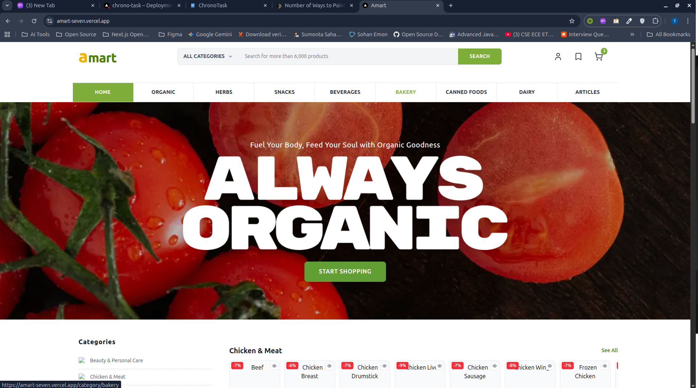

# Amart - Modern Grocery Ecommerce

<div align="center">

[](https://nextjs.org/)
[](https://www.typescriptlang.org/)
[](https://tailwindcss.com/)
[](LICENSE)

</div>

<br />

<div align="center">
  <a href="https://github.com/t0uhidul/amart">
    
  </a>
</div>

<br />

<div align="center">
  <h3>
    <a href="#features">Features</a> •
    <a href="#tech-stack">Tech Stack</a> •
    <a href="#getting-started">Getting Started</a> •
    <a href="#contributing">Contributing</a>
  </h3>
</div>

---

## 📖 About The Project

**Amart** is a state-of-the-art ecommerce platform designed to revolutionize the online grocery shopping experience. Built with performance, accessibility, and user experience at its core, Amart leverages the latest web technologies to deliver a seamless, fast, and visually stunning interface for modern shoppers.

Whether browsing for daily essentials or managing bulk orders, Amart provides a robust solution with real-time updates, secure authentication, and a beautifully crafted UI that adapts to every device.

## ✨ Key Features

- **🎨 Premium UI/UX**: Designed with a focus on aesthetics and usability, featuring glassmorphism, smooth animations with **Framer Motion**, and a cohesive design system.
- **⚡ High Performance**: Powered by **Next.js 16** for ensuring lightning-fast load times and optimal SEO.
- **🛡️ Secure Authentication**: Robust user session management secured with JWT.
- **🛒 Smart Cart System**: Real-time shopping cart functionality with persistent state management via Context API.
- **🔍 Advanced Discovery**: Intuitive product discovery with dynamic category sidebars, filtering, and instant search.
- **📱 Fully Responsive**: Flawless experience across all devices - Desktop, Tablet, and Mobile.
- **🔔 Interactive Feedback**: Elegant toast notifications (Sonner) and polished skeleton loading states.

## 🛠️ Tech Stack

This project is built using a curated list of modern technologies:

| Category | Technology | Description |
| :--- | :--- | :--- |
| **Framework** | [Next.js 16](https://nextjs.org/) | The React Framework for the Web |
| **Language** | [TypeScript](https://www.typescriptlang.org/) | Typed JavaScript at Any Scale |
| **Styling** | [Tailwind CSS 4](https://tailwindcss.com/) | A utility-first CSS framework |
| **UI Components** | [Radix UI](https://www.radix-ui.com/) | Unstyled, accessible components |
| **Icons** | [Lucide React](https://lucide.dev/) | Beautiful & consistent icons |
| **State Management** | React Context & Query | Efficient server and client state sync |
| **Animations** | [Framer Motion](https://www.framer.com/motion/) | Production-ready animation library |
| **Carousel** | [Embla Carousel](https://www.embla-carousel.com/) | A lightweight carousel library |

## 🚀 Getting Started

To get a local copy up and running, follow these simple steps.

### Prerequisites

Ensure you have the following installed:
*   Node.js (v18.17 or later)
*   npm, yarn, pnpm, or bun

### Installation

1.  **Clone the repository**
    ```bash
    git clone https://github.com/t0uhidul/amart.git
    cd amart
    ```

2.  **Install dependencies**
    ```bash
    npm install
    # or
    yarn install
    ```

3.  **Configure Environment Variables**
    Create a `.env.local` file in the root directory and add your necessary variables:
    ```env
    # Example variables
    NEXT_PUBLIC_API_URL=http://localhost:8000
    JWT_SECRET=your_super_secret_key
    ```

4.  **Start the Development Server**
    ```bash
    npm run dev
    ```

5.  **Open in Browser**
    Visit [http://localhost:3000](http://localhost:3000) to view the application.

## 📂 Project Structure

```bash
amart/
├── app/                    # Next.js App Router (Pages & Layouts)
│   ├── (routes)/           # Route groups for organized pages
│   ├── _components/        # Shared, reusable UI components
│   ├── _utils/             # Helper functions and utilities
│   ├── contexts/           # Global state providers (Auth, Cart)
│   └── lib/                # Library configurations
├── public/                 # Static assets (images, icons)
├── project_screen/         # Project screenshots and media
└── ...
```

## 🤝 Contributing

Contributions are what make the open-source community such an amazing place to learn, inspire, and create. Any contributions you make are **greatly appreciated**.

1.  Fork the Project
2.  Create your Feature Branch (`git checkout -b feature/AmazingFeature`)
3.  Commit your Changes (`git commit -m 'Add some AmazingFeature'`)
4.  Push to the Branch (`git push origin feature/AmazingFeature`)
5.  Open a Pull Request

## 📄 License

Distributed under the MIT License. See `LICENSE` for more information.


---
<div align="center">
  <p>Built with ❤️ by Touhid</p>
</div>
