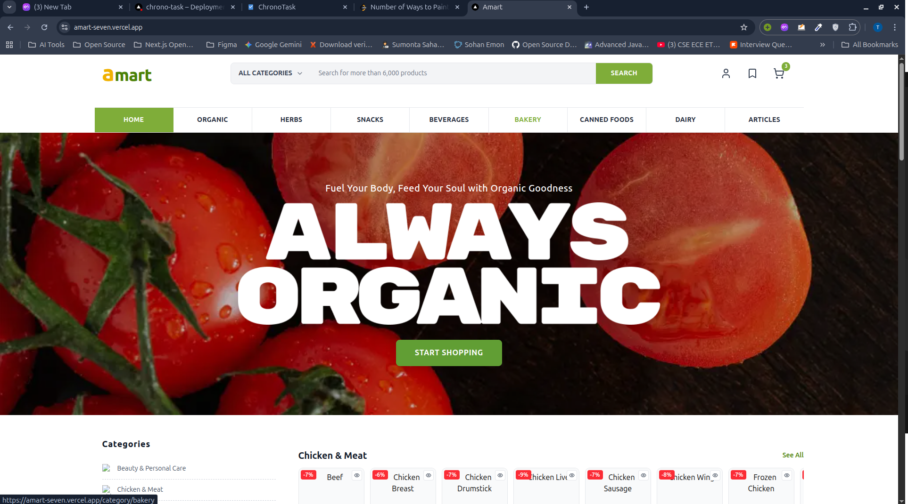

# Amart - Modern Grocery E-Commerce

  

 

**Amart** is a state-of-the-art e-commerce frontend designed for modern grocery shopping. It combines lightning-fast React Server Components with a secure, headless Python/Django backend. It is meticulously engineered for performance, strict typing, and an enterprise-grade UI experience.

---

## ✨ Features & Architecture

- **Next.js 16 App Router**: Deeply integrates Server Actions (`use server`) to keep sensitive business logic entirely hidden from the browser.
- **Strict Server-Side Auth**: Tokens (including JWTs from the Python backend) are stored as strictly secure, `httpOnly` cookies via Server Actions. The client _never_ accesses or manipulates raw tokens, parsing strictly public claims asynchronously for routing UI states.
- **Aesthetic UI System**: Fully customized **shadcn/ui** components seamlessly blended with **Tailwind CSS v4** and beautiful **Lucide React** iconography.
- **Smart Global State**: Highly optimized React contexts tracking application-wide `Cart` and `Auth` status using mathematically stable `.forEach` mappings and `useMemo()` dependency wrappers.
- **Zero-Friction Checkout**: Dynamic order payload delivery backed directly by secure Node.js interceptors.

## 🛠️ Unified Tech Stack

| Category                | Technology                                                 |
| :---------------------- | :--------------------------------------------------------- |
| **Meta Framework**      | [Next.js 16](https://nextjs.org/) (App Router & Turbopack) |
| **Language**            | [TypeScript 5](https://www.typescriptlang.org/)            |
| **Styling & CSS**       | [Tailwind CSS v4](https://tailwindcss.com/)                |
| **UI Ecosystem**        | [shadcn/ui](https://ui.shadcn.com/) + Radix UI Primitives  |
| **Toasts & Feedback**   | [Sonner](https://sonner.emilkowal.ski/)                    |
| **Animations & Modals** | Framer Motion & Vaul (Mobile Drawers)                      |
| **Icons**               | [Lucide React](https://lucide.dev/)                        |
| **API Client**          | [Axios](https://axios-http.com/)                           |

## 📄 License

Distributed under the MIT License.
